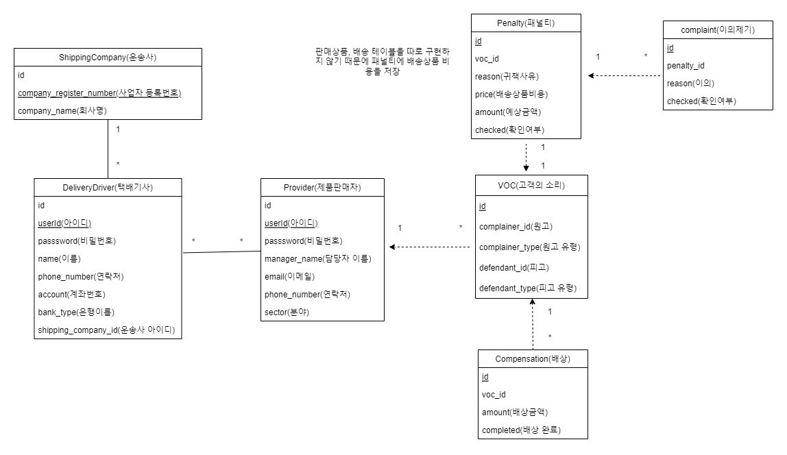

# TeamFreash 사전과제

## 테이블 스키마

## 클래스 다이어그램

## 구현해야할 API
* VOC 목록 API
* 배상 목록 API
* VOC 등록 API
* 배상정보 등록 API

## 개요
팀프래시는 3PL 삼자물류를 하는 업체

고객사(제품판매자) <-> 기사(고용 from 운송사) <-> 클라이언트

클레임이 생길 경우 VOC를 등록함

> VOC 등록시, 귀책을 운송사나 고객사로 설정해야함

* 운송사 귀책 -> 운송사의 기사님이 배송을 잘못보냄, 배송이 늦어짐
* 고객사 귀책 -> 운송사의 기사님이 정상 배송하였지만, 객사에서 물건을 누락

> 운송사에 대한 귀책은 접수 후 바로 배상 시스템에 적용
> 기사님의 귀책인 경우, 기사님에게 페널티(비용 청구)를 접수 및 발급받아야함

### 시나리오

1. 고객사에서 배상을 청구(기사님의 귀책)
2. 기사님이 APP에서 확인하시고, 본인의 귀책을 인정하고 사인을 함(이의제기x)
3. 배상 금액만큼 배상 시스템에 포함되고, 그 금액만큼 기사님의 월급 차감

### 고려 사항
* 클레임 인입 여부
* 배상 요청 여부
* 배송 건 VOC 귀책 여부에 따른 프로세스
* 귀책 불인정 시, 처리 프로세스

## 요구 사항
1. VOC 목록 API
   * 페이징 구현 x
   * VOC의 귀책 당사자, 귀책 내용, 패널티 내용, 기사 확인 여부, 이의제기 여부, 배상정보 등의 정보가 포함되어야함
2. 배상목록 API
    * 페이징 구현 x
    * 배상정보의 VOC 정보, 배상금액 정보 등이 포함되어야 함
3. 공통
   * VOC 등록
   * 패널티 등록
   * 배송기사의 패널티 확인 여부 등록
   * 배상정보 등록
     * 배상정보의 부모정보인 VOC 정보를 참조할 수 있게 관계를 고려해서 개발

## 고려 사항
* VOC, 패널티, 배상 정보 등이 서로 참조 관계

## 기타
* VOC, 패널티, 배상 정보 등을 위한 운송사 정보(운송사, 기사, 정보 등), 고객사 정보(고객사 및 고객사 담당자 정보, 연락처 등),
* 귀책 당사자는 고객사/운송사 2개 코드를 해야함